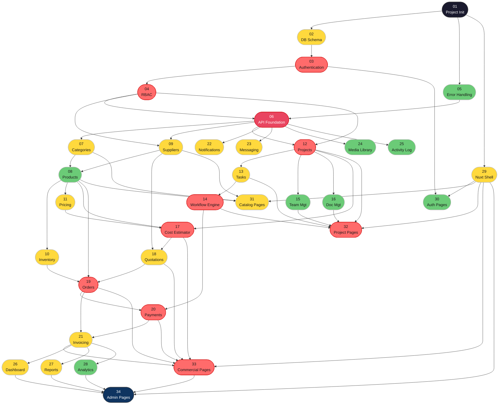

# Bunyan — Implementation Order

> **Generated:** 2026-04-10
> **Stages:** 34 across 7 phases
> **Strategy:** Topological sort derived from spec dependency declarations
> **Source of truth:** Per-stage `Upstream:` declarations + `DEPENDENCY_GRAPH.md` + `INDEX.md`

---

## Summary

| Metric               | Value                                         |
| -------------------- | --------------------------------------------- |
| Total stages         | 34                                            |
| Execution waves      | 15                                            |
| Maximum parallelism  | 7 stages (Wave 6)                             |
| Critical path length | 15 waves                                      |
| High-risk stages     | 10 (STAGE_03, 04, 12, 14, 17, 19, 20, 32, 33) |
| Terminal stage       | STAGE_34 (Admin Pages)                        |

---

## Recommended AI Models for Implementation

Each stage has a recommended AI model for implementation based on complexity and risk level:

| Model             | Risk Level | Use Case                                                               | Count |
| ----------------- | ---------- | ---------------------------------------------------------------------- | ----- |
| Claude Opus 4.6   | HIGH       | Complex logic, security-critical auth, state machines, payment systems | 9     |
| Claude Sonnet 4.6 | MEDIUM     | Feature modules, business logic, API design, complex queries           | 17    |
| Claude Haiku 4.5  | LOW        | Configuration, simple CRUD, utility modules, scaffolding               | 8     |

**Selection Criteria:**

- **Claude Opus 4.6** (9 stages): Assigned to HIGH-risk stages requiring deep architectural reasoning, complex workflow logic, security-critical components (STAGE_03, 04, 12, 14, 17, 19, 20, 32, 33)
- **Claude Sonnet 4.6** (17 stages): Assigned to MEDIUM-risk stages with solid business logic requirements (database schema, APIs, features, reporting)
- **Claude Haiku 4.5** (8 stages): Assigned to LOW-risk stages with straightforward requirements, standard configuration, and simple features (STAGE_01, 05, 07, 09, 15, 16, 22, 24, 25, 28, 30, 34)

---

## Dependency Resolution Rules

1. Explicit `Upstream:` declarations in each stage spec file take precedence.
2. `DEPENDENCY_GRAPH.md` and `INDEX.md` serve as secondary confirmation.
3. All API-endpoint stages carry an implicit dependency on STAGE_06 (API Foundation).
4. Frontend page stages carry an implicit dependency on STAGE_29 (Nuxt Shell).
5. Stages within the same wave have no inter-dependencies and may be parallelised.

---

## Critical Path

The longest chain from start to finish (15 stages):

```
STAGE_01 → STAGE_02 → STAGE_03 → STAGE_04 → STAGE_06
         → STAGE_07 → STAGE_08 → STAGE_11 → STAGE_17
         → STAGE_18 → STAGE_19 → STAGE_20 → STAGE_21
         → STAGE_33 → STAGE_34
```

Any delay on the critical path delays the entire platform delivery.

---

## Execution Waves

Stages inside the same wave have no mutual dependencies and can be built in parallel.
Each wave must be fully **complete** before the next wave starts.

---

### Wave 1 — Bootstrap

| Stage    | Name                   | Phase               | Risk | Recommended Model |
| -------- | ---------------------- | ------------------- | ---- | ----------------- |
| STAGE_01 | Project Initialization | Platform Foundation | LOW  | Claude Haiku 4.5  |

> Entry point. Zero upstream dependencies. Sets up Laravel, Nuxt.js, Docker, CI.

**Unlocks:** STAGE_02, STAGE_05, STAGE_29

---

### Wave 2 — Infrastructure Parallel

| Stage    | Name            | Phase                | Risk   | Recommended Model |
| -------- | --------------- | -------------------- | ------ | ----------------- |
| STAGE_02 | Database Schema | Platform Foundation  | MEDIUM | Claude Sonnet 4.6 |
| STAGE_05 | Error Handling  | Platform Foundation  | LOW    | Claude Haiku 4.5  |
| STAGE_29 | Nuxt Shell      | Frontend Application | MEDIUM | Claude Sonnet 4.6 |

> These three have no dependency on each other. Run in parallel.
> STAGE_29 (frontend shell) can be scaffolded while backend schema is being built.

**Unlocks:** STAGE_03 (needs 02); STAGE_30 partial (needs 03 + 29)

---

### Wave 3 — Authentication Core

| Stage    | Name           | Phase               | Risk | Recommended Model |
| -------- | -------------- | ------------------- | ---- | ----------------- |
| STAGE_03 | Authentication | Platform Foundation | HIGH | Claude Opus 4.6   |

> Highest-risk serial bottleneck in Phase 01. Sanctum token auth for all roles.

**Unlocks:** STAGE_04, partial unlock of STAGE_30

---

### Wave 4 — RBAC + Auth Pages

| Stage    | Name        | Phase                | Risk | Recommended Model |
| -------- | ----------- | -------------------- | ---- | ----------------- |
| STAGE_04 | RBAC System | Platform Foundation  | HIGH | Claude Opus 4.6   |
| STAGE_30 | Auth Pages  | Frontend Application | LOW  | Claude Haiku 4.5  |

> STAGE_30 needs STAGE_03 (auth backend) + STAGE_29 (shell) — both now available.
> STAGE_04 defines all five roles; gates every downstream protected route.

**Unlocks:** STAGE_06

---

### Wave 5 — API Foundation (Critical Gate)

| Stage    | Name           | Phase               | Risk   | Recommended Model |
| -------- | -------------- | ------------------- | ------ | ----------------- |
| STAGE_06 | API Foundation | Platform Foundation | MEDIUM | Claude Sonnet 4.6 |

> **All feature modules depend on this stage.** Establishes versioned routing (`/api/v1/*`),
> middleware stack (CORS → Rate Limit → Sanctum → RBAC → Correlation ID), base
> controller, API Resource base class, and OpenAPI scaffold.

**Unlocks:** STAGE_07, STAGE_09, STAGE_12, STAGE_22, STAGE_23, STAGE_24, STAGE_25

---

### Wave 6 — Feature Module Roots (Maximum Parallelism)

| Stage    | Name          | Phase                 | Risk   | Recommended Model |
| -------- | ------------- | --------------------- | ------ | ----------------- |
| STAGE_07 | Categories    | Catalog & Inventory   | LOW    | Claude Haiku 4.5  |
| STAGE_09 | Suppliers     | Catalog & Inventory   | MEDIUM | Claude Sonnet 4.6 |
| STAGE_12 | Projects      | Project Management    | HIGH   | Claude Opus 4.6   |
| STAGE_22 | Notifications | Communication & Media | MEDIUM | Claude Sonnet 4.6 |
| STAGE_23 | Messaging     | Communication & Media | MEDIUM | Claude Sonnet 4.6 |
| STAGE_24 | Media Library | Communication & Media | LOW    | Claude Haiku 4.5  |
| STAGE_25 | Activity Log  | Communication & Media | LOW    | Claude Haiku 4.5  |

> Peak parallelism — 7 independent modules. All root feature modules open here.
> STAGE_22–25 (Communication & Media) can continue independently in all later waves.

**Unlocks:** STAGE_08 (needs 07+09); STAGE_13, STAGE_15, STAGE_16 (need 12)

---

### Wave 7 — Products + Project Sub-Modules

| Stage    | Name                | Phase               | Risk   | Recommended Model |
| -------- | ------------------- | ------------------- | ------ | ----------------- |
| STAGE_08 | Products            | Catalog & Inventory | MEDIUM | Claude Sonnet 4.6 |
| STAGE_13 | Tasks               | Project Management  | MEDIUM | Claude Sonnet 4.6 |
| STAGE_15 | Team Management     | Project Management  | LOW    | Claude Haiku 4.5  |
| STAGE_16 | Document Management | Project Management  | LOW    | Claude Haiku 4.5  |

> STAGE_08 needs both STAGE_07 (categories) and STAGE_09 (suppliers).
> STAGE_13, STAGE_15, STAGE_16 all root from STAGE_12.

**Unlocks:** STAGE_10, STAGE_11 (need 08); STAGE_14 (needs 13); STAGE_31 (needs 07+08+09+29)

---

### Wave 8 — Inventory + Workflow + Catalog Frontend

| Stage    | Name            | Phase                | Risk   | Recommended Model |
| -------- | --------------- | -------------------- | ------ | ----------------- |
| STAGE_10 | Inventory       | Catalog & Inventory  | MEDIUM | Claude Sonnet 4.6 |
| STAGE_11 | Pricing         | Catalog & Inventory  | MEDIUM | Claude Sonnet 4.6 |
| STAGE_14 | Workflow Engine | Project Management   | HIGH   | Claude Opus 4.6   |
| STAGE_31 | Catalog Pages   | Frontend Application | MEDIUM | Claude Sonnet 4.6 |

> STAGE_14 (Workflow Engine) is a HIGH-risk stage that blocks payments (STAGE_20).
> STAGE_31 completes the catalog frontend loop (categories → products → suppliers).

**Unlocks:** STAGE_17 (needs 08+11+12); STAGE_32 (needs 12–16+29)

---

### Wave 9 — Cost Estimator + Project Pages

| Stage    | Name           | Phase                | Risk | Recommended Model |
| -------- | -------------- | -------------------- | ---- | ----------------- |
| STAGE_17 | Cost Estimator | Commercial Layer     | HIGH | Claude Opus 4.6   |
| STAGE_32 | Project Pages  | Frontend Application | HIGH | Claude Opus 4.6   |

> STAGE_17 opens the commercial pipeline. Needs product catalog (08), pricing (11), and projects (12).
> STAGE_32 is the most complex frontend stage — tabbed project UI, Kanban, Gantt, BOQ builder.

**Unlocks:** STAGE_18

---

### Wave 10 — Quotations

| Stage    | Name       | Phase            | Risk   | Recommended Model |
| -------- | ---------- | ---------------- | ------ | ----------------- |
| STAGE_18 | Quotations | Commercial Layer | MEDIUM | Claude Sonnet 4.6 |

> RFQ → supplier quote → accept flow. Needs suppliers (09) and cost estimator (17).

**Unlocks:** STAGE_19

---

### Wave 11 — Orders

| Stage    | Name   | Phase            | Risk | Recommended Model |
| -------- | ------ | ---------------- | ---- | ----------------- |
| STAGE_19 | Orders | Commercial Layer | HIGH | Claude Opus 4.6   |

> Needs products (08), inventory (10), quotations (18). Creates inventory reservations.

**Unlocks:** STAGE_20

---

### Wave 12 — Payments

| Stage    | Name     | Phase            | Risk | Recommended Model |
| -------- | -------- | ---------------- | ---- | ----------------- |
| STAGE_20 | Payments | Commercial Layer | HIGH | Claude Opus 4.6   |

> Saudi payment gateway integration (Moyasar/HyperPay/Tap). Needs orders (19) + workflow (14).

**Unlocks:** STAGE_21

---

### Wave 13 — Invoicing

| Stage    | Name      | Phase            | Risk   | Recommended Model |
| -------- | --------- | ---------------- | ------ | ----------------- |
| STAGE_21 | Invoicing | Commercial Layer | MEDIUM | Claude Sonnet 4.6 |

> ZATCA e-invoicing compliance. Auto-generates from completed orders.
> Needs orders (19) + payments (20).

**Unlocks:** STAGE_26, STAGE_27, STAGE_28, STAGE_33

---

### Wave 14 — Reporting + Commercial Frontend

| Stage    | Name             | Phase                 | Risk   | Recommended Model |
| -------- | ---------------- | --------------------- | ------ | ----------------- |
| STAGE_26 | Dashboard        | Reporting & Analytics | MEDIUM | Claude Sonnet 4.6 |
| STAGE_27 | Reports          | Reporting & Analytics | MEDIUM | Claude Sonnet 4.6 |
| STAGE_28 | Analytics        | Reporting & Analytics | LOW    | Claude Haiku 4.5  |
| STAGE_33 | Commercial Pages | Frontend Application  | HIGH   | Claude Opus 4.6   |

> All reporting stages aggregate across the full platform — only safe after STAGE_21 closes the commercial loop.
> STAGE_33 bridges the complete commercial backend (17–21) with the frontend.

**Unlocks:** STAGE_34

---

### Wave 15 — Admin Panel (Terminal Stage)

| Stage    | Name        | Phase                | Risk   | Recommended Model |
| -------- | ----------- | -------------------- | ------ | ----------------- |
| STAGE_34 | Admin Pages | Frontend Application | MEDIUM | Claude Sonnet 4.6 |

> Terminal stage. Aggregates all platform capabilities into the admin panel:
> user management, role management, supplier verification, reports center, analytics dashboard,
> activity log, platform settings.
> Cannot be started until all preceding stages are working.

---

## Linear Execution Order

For teams that cannot parallelise, guaranteed-safe sequential order (34 steps):

```
 1. STAGE_01  — Project Initialization      [Platform Foundation]
 2. STAGE_02  — Database Schema             [Platform Foundation]
 3. STAGE_05  — Error Handling              [Platform Foundation]
 4. STAGE_29  — Nuxt Shell                  [Frontend Application]
 5. STAGE_03  — Authentication              [Platform Foundation]
 6. STAGE_04  — RBAC System                 [Platform Foundation]
 7. STAGE_30  — Auth Pages                  [Frontend Application]
 8. STAGE_06  — API Foundation              [Platform Foundation]
 9. STAGE_07  — Categories                  [Catalog & Inventory]
10. STAGE_09  — Suppliers                   [Catalog & Inventory]
11. STAGE_12  — Projects                    [Project Management]
12. STAGE_22  — Notifications               [Communication & Media]
13. STAGE_23  — Messaging                   [Communication & Media]
14. STAGE_24  — Media Library               [Communication & Media]
15. STAGE_25  — Activity Log                [Communication & Media]
16. STAGE_08  — Products                    [Catalog & Inventory]
17. STAGE_13  — Tasks                       [Project Management]
18. STAGE_15  — Team Management             [Project Management]
19. STAGE_16  — Document Management         [Project Management]
20. STAGE_10  — Inventory                   [Catalog & Inventory]
21. STAGE_11  — Pricing                     [Catalog & Inventory]
22. STAGE_14  — Workflow Engine             [Project Management]
23. STAGE_31  — Catalog Pages               [Frontend Application]
24. STAGE_17  — Cost Estimator              [Commercial Layer]
25. STAGE_32  — Project Pages               [Frontend Application]
26. STAGE_18  — Quotations                  [Commercial Layer]
27. STAGE_19  — Orders                      [Commercial Layer]
28. STAGE_20  — Payments                    [Commercial Layer]
29. STAGE_21  — Invoicing                   [Commercial Layer]
30. STAGE_26  — Dashboard                   [Reporting & Analytics]
31. STAGE_27  — Reports                     [Reporting & Analytics]
32. STAGE_28  — Analytics                   [Reporting & Analytics]
33. STAGE_33  — Commercial Pages            [Frontend Application]
34. STAGE_34  — Admin Pages                 [Frontend Application]
```

---

## Full Dependency Graph (Mermaid)



---

## Phase-Level Wave Map

```
Wave │ Stage(s)
─────┼──────────────────────────────────────────────────────────────────────────
  1  │ 01
  2  │ 02  05  29
  3  │ 03
  4  │ 04  30
  5  │ 06                          ◄── Critical Gate
  6  │ 07  09  12  22  23  24  25  ◄── Max Parallelism (7)
  7  │ 08  13  15  16
  8  │ 10  11  14  31
  9  │ 17  32
 10  │ 18
 11  │ 19
 12  │ 20
 13  │ 21
 14  │ 26  27  28  33
 15  │ 34                          ◄── Terminal
─────┴──────────────────────────────────────────────────────────────────────────
```

---

## Risk Heat-Map on Critical Path

Stages on the critical path ordered by wave, with risk indicators:

| Wave | Stage    | Name                   | Risk      | Recommended Model | Note                            |
| ---- | -------- | ---------------------- | --------- | ----------------- | ------------------------------- |
| 1    | STAGE_01 | Project Initialization | 🟢 LOW    | Claude Haiku 4.5  | Foundation gate                 |
| 2    | STAGE_02 | Database Schema        | 🟡 MEDIUM | Claude Sonnet 4.6 | Schema changes are costly later |
| 3    | STAGE_03 | Authentication         | 🔴 HIGH   | Claude Opus 4.6   | Sanctum + all auth flows        |
| 4    | STAGE_04 | RBAC System            | 🔴 HIGH   | Claude Opus 4.6   | Gates all protected routes      |
| 5    | STAGE_06 | API Foundation         | 🟡 MEDIUM | Claude Sonnet 4.6 | Unlocks everything              |
| 6    | STAGE_07 | Categories             | 🟢 LOW    | Claude Haiku 4.5  | —                               |
| 7    | STAGE_08 | Products               | 🟡 MEDIUM | Claude Sonnet 4.6 | —                               |
| 8    | STAGE_11 | Pricing                | 🟡 MEDIUM | Claude Sonnet 4.6 | Feeds estimator                 |
| 9    | STAGE_17 | Cost Estimator         | 🔴 HIGH   | Claude Opus 4.6   | BOQ engine complexity           |
| 10   | STAGE_18 | Quotations             | 🟡 MEDIUM | Claude Sonnet 4.6 | RFQ workflow                    |
| 11   | STAGE_19 | Orders                 | 🔴 HIGH   | Claude Opus 4.6   | Inventory + fulfillment         |
| 12   | STAGE_20 | Payments               | 🔴 HIGH   | Claude Opus 4.6   | Gateway + webhooks              |
| 13   | STAGE_21 | Invoicing              | 🟡 MEDIUM | Claude Sonnet 4.6 | ZATCA compliance                |
| 14   | STAGE_33 | Commercial Pages       | 🔴 HIGH   | Claude Opus 4.6   | Full checkout + payment UI      |
| 15   | STAGE_34 | Admin Pages            | 🟡 MEDIUM | Claude Sonnet 4.6 | Aggregation only                |

**6 of 15 critical-path stages are HIGH risk.** Prioritise early risk resolution on STAGE_03, STAGE_04, STAGE_17, STAGE_19, STAGE_20, STAGE_33.

---

## Parallel Track Summary

Three independent development tracks can proceed concurrently after Wave 6:

| Track             | Stages                           | Joins back at            |
| ----------------- | -------------------------------- | ------------------------ |
| **Catalog track** | 08 → 10 → 11 → (17)              | Wave 9 (STAGE_17)        |
| **Project track** | 13 → 14 → 15 → 16 → (20)         | Wave 12 (STAGE_20)       |
| **Comms track**   | 22, 23, 24, 25 (all independent) | Wave 14 (STAGE_26/27/28) |

Frontend track: 29 (Wave 2) → 30 (Wave 4) → 31 (Wave 8) → 32 (Wave 9) → 33 (Wave 14) → 34 (Wave 15)

---

## Complete Stage Reference with AI Models

Quick lookup table for all 34 stages with their assigned models:

| Stage    | Name                   | Phase                 | Risk   | Model             | Wave |
| -------- | ---------------------- | --------------------- | ------ | ----------------- | ---- |
| STAGE_01 | Project Initialization | Platform Foundation   | LOW    | Claude Haiku 4.5  | 1    |
| STAGE_02 | Database Schema        | Platform Foundation   | MEDIUM | Claude Sonnet 4.6 | 2    |
| STAGE_03 | Authentication         | Platform Foundation   | HIGH   | Claude Opus 4.6   | 3    |
| STAGE_04 | RBAC System            | Platform Foundation   | HIGH   | Claude Opus 4.6   | 4    |
| STAGE_05 | Error Handling         | Platform Foundation   | LOW    | Claude Haiku 4.5  | 2    |
| STAGE_06 | API Foundation         | Platform Foundation   | MEDIUM | Claude Sonnet 4.6 | 5    |
| STAGE_07 | Categories             | Catalog & Inventory   | LOW    | Claude Haiku 4.5  | 6    |
| STAGE_08 | Products               | Catalog & Inventory   | MEDIUM | Claude Sonnet 4.6 | 7    |
| STAGE_09 | Suppliers              | Catalog & Inventory   | MEDIUM | Claude Sonnet 4.6 | 6    |
| STAGE_10 | Inventory              | Catalog & Inventory   | MEDIUM | Claude Sonnet 4.6 | 8    |
| STAGE_11 | Pricing                | Catalog & Inventory   | MEDIUM | Claude Sonnet 4.6 | 8    |
| STAGE_12 | Projects               | Project Management    | HIGH   | Claude Opus 4.6   | 6    |
| STAGE_13 | Tasks                  | Project Management    | MEDIUM | Claude Sonnet 4.6 | 7    |
| STAGE_14 | Workflow Engine        | Project Management    | HIGH   | Claude Opus 4.6   | 8    |
| STAGE_15 | Team Management        | Project Management    | LOW    | Claude Haiku 4.5  | 7    |
| STAGE_16 | Document Management    | Project Management    | LOW    | Claude Haiku 4.5  | 7    |
| STAGE_17 | Cost Estimator         | Commercial Layer      | HIGH   | Claude Opus 4.6   | 9    |
| STAGE_18 | Quotations             | Commercial Layer      | MEDIUM | Claude Sonnet 4.6 | 10   |
| STAGE_19 | Orders                 | Commercial Layer      | HIGH   | Claude Opus 4.6   | 11   |
| STAGE_20 | Payments               | Commercial Layer      | HIGH   | Claude Opus 4.6   | 12   |
| STAGE_21 | Invoicing              | Commercial Layer      | MEDIUM | Claude Sonnet 4.6 | 13   |
| STAGE_22 | Notifications          | Communication & Media | MEDIUM | Claude Sonnet 4.6 | 6    |
| STAGE_23 | Messaging              | Communication & Media | MEDIUM | Claude Sonnet 4.6 | 6    |
| STAGE_24 | Media Library          | Communication & Media | LOW    | Claude Haiku 4.5  | 6    |
| STAGE_25 | Activity Log           | Communication & Media | LOW    | Claude Haiku 4.5  | 6    |
| STAGE_26 | Dashboard              | Reporting & Analytics | MEDIUM | Claude Sonnet 4.6 | 14   |
| STAGE_27 | Reports                | Reporting & Analytics | MEDIUM | Claude Sonnet 4.6 | 14   |
| STAGE_28 | Analytics              | Reporting & Analytics | LOW    | Claude Haiku 4.5  | 14   |
| STAGE_29 | Nuxt Shell             | Frontend Application  | MEDIUM | Claude Sonnet 4.6 | 2    |
| STAGE_30 | Auth Pages             | Frontend Application  | LOW    | Claude Haiku 4.5  | 4    |
| STAGE_31 | Catalog Pages          | Frontend Application  | MEDIUM | Claude Sonnet 4.6 | 8    |
| STAGE_32 | Project Pages          | Frontend Application  | HIGH   | Claude Opus 4.6   | 9    |
| STAGE_33 | Commercial Pages       | Frontend Application  | HIGH   | Claude Opus 4.6   | 14   |
| STAGE_34 | Admin Pages            | Frontend Application  | MEDIUM | Claude Sonnet 4.6 | 15   |

**Model Distribution:**

- **Claude Opus 4.6** (9 stages): STAGE_03, 04, 12, 14, 17, 19, 20, 32, 33
- **Claude Sonnet 4.6** (17 stages): STAGE_02, 06, 08, 09, 10, 11, 13, 18, 21, 22, 23, 26, 27, 29, 31, 34
- **Claude Haiku 4.5** (8 stages): STAGE_01, 05, 07, 15, 16, 24, 25, 28, 30
