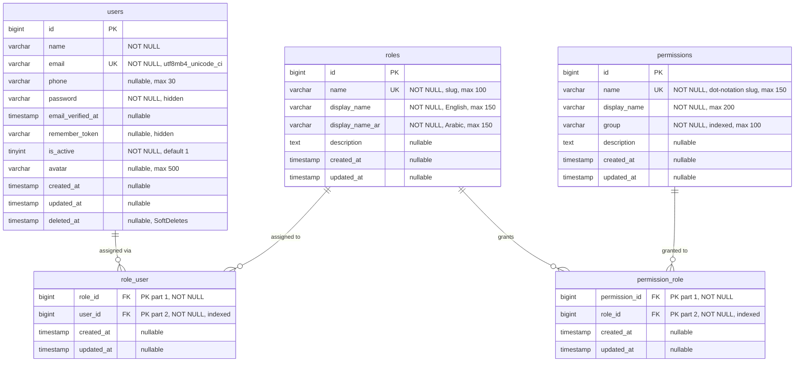

# Data Model — STAGE_02: Database Schema Foundation

**Stage**: STAGE_02 — DATABASE_SCHEMA
**Branch**: `spec/002-database-schema`
**Prepared**: 2026-04-11

---

## Entity-Relationship Diagram

---

## Table Specifications

### `users` Table

Full columns after STAGE_01 base + STAGE_02 alterations:

| # | Column | Type | Nullable | Default | Constraint | Notes |
|---|--------|------|----------|---------|------------|-------|
| 1 | `id` | `bigint UNSIGNED` | NO | — | PK, AUTO_INCREMENT | |
| 2 | `name` | `varchar(255)` | NO | — | | utf8mb4 |
| 3 | `email` | `varchar(255)` | NO | — | UNIQUE | utf8mb4_unicode_ci |
| 4 | `phone` | `varchar(30)` | YES | NULL | | E.164 format; added in STAGE_02 |
| 5 | `password` | `varchar(255)` | NO | — | | Bcrypt; hidden from serialization |
| 6 | `email_verified_at` | `timestamp` | YES | NULL | | |
| 7 | `remember_token` | `varchar(100)` | YES | NULL | | Hidden from serialization |
| 8 | `is_active` | `tinyint(1)` | NO | `1` | | Boolean cast; added in STAGE_02 |
| 9 | `avatar` | `varchar(500)` | YES | NULL | | Relative or S3 path; added in STAGE_02 |
| 10 | `created_at` | `timestamp` | YES | NULL | | Laravel managed |
| 11 | `updated_at` | `timestamp` | YES | NULL | | Laravel managed |
| 12 | `deleted_at` | `timestamp` | YES | NULL | | SoftDeletes; added in STAGE_02 |

> **Note**: `role` enum column (STAGE_01) also remains — see research.md §3 for coexistence rationale.

**Indexes on `users`**:
- `UNIQUE(email)` — already from STAGE_01
- `INDEX(role)` — already from STAGE_01
- `INDEX(created_at)` — already from STAGE_01
- `INDEX(is_active)` — added in Migration 1
- `INDEX(deleted_at)` — added in Migration 1

---

### `roles` Table

| # | Column | Type | Nullable | Default | Constraint | Notes |
|---|--------|------|----------|---------|------------|-------|
| 1 | `id` | `bigint UNSIGNED` | NO | — | PK, AUTO_INCREMENT | |
| 2 | `name` | `varchar(100)` | NO | — | UNIQUE | Slug (e.g., `admin`) |
| 3 | `display_name` | `varchar(150)` | NO | — | | English label |
| 4 | `display_name_ar` | `varchar(150)` | NO | — | | Arabic label (utf8mb4) |
| 5 | `description` | `text` | YES | NULL | | |
| 6 | `created_at` | `timestamp` | YES | NULL | | |
| 7 | `updated_at` | `timestamp` | YES | NULL | | |

**Indexes on `roles`**:
- `UNIQUE(name)` — enforced via `$table->unique('name')`

**No SoftDeletes** — roles are configuration data (NFR-007).

---

### `permissions` Table

| # | Column | Type | Nullable | Default | Constraint | Notes |
|---|--------|------|----------|---------|------------|-------|
| 1 | `id` | `bigint UNSIGNED` | NO | — | PK, AUTO_INCREMENT | |
| 2 | `name` | `varchar(150)` | NO | — | UNIQUE | Dot-notation slug (e.g., `users.create`) |
| 3 | `display_name` | `varchar(200)` | NO | — | | Human-readable English label |
| 4 | `group` | `varchar(100)` | NO | — | INDEX | Domain group |
| 5 | `description` | `text` | YES | NULL | | |
| 6 | `created_at` | `timestamp` | YES | NULL | | |
| 7 | `updated_at` | `timestamp` | YES | NULL | | |

**Indexes on `permissions`**:
- `UNIQUE(name)` — dot-notation slug uniqueness
- `INDEX(group)` — required by NFR-003 for group-based lookups

**No SoftDeletes** — permissions are configuration data (NFR-007).

---

### `role_user` Pivot Table

| # | Column | Type | Nullable | Constraint | Notes |
|---|--------|------|----------|------------|-------|
| 1 | `role_id` | `bigint UNSIGNED` | NO | FK → `roles.id` CASCADE | Part of composite PK |
| 2 | `user_id` | `bigint UNSIGNED` | NO | FK → `users.id` CASCADE | Part of composite PK |
| 3 | `created_at` | `timestamp` | YES | | Pivot timestamps |
| 4 | `updated_at` | `timestamp` | YES | | Pivot timestamps |

**Primary Key**: Composite `(role_id, user_id)` — no auto-increment (FR-015).

**Indexes on `role_user`**:
- Composite PK implicitly indexes `(role_id, user_id)`
- `INDEX(user_id)` — explicit secondary index for reverse lookup (`user → roles`)

**Cascade behavior**:
- DELETE role → DELETE all `role_user` rows for that role
- DELETE user → DELETE all `role_user` rows for that user

---

### `permission_role` Pivot Table

| # | Column | Type | Nullable | Constraint | Notes |
|---|--------|------|----------|------------|-------|
| 1 | `permission_id` | `bigint UNSIGNED` | NO | FK → `permissions.id` CASCADE | Part of composite PK |
| 2 | `role_id` | `bigint UNSIGNED` | NO | FK → `roles.id` CASCADE | Part of composite PK |
| 3 | `created_at` | `timestamp` | YES | | Pivot timestamps |
| 4 | `updated_at` | `timestamp` | YES | | Pivot timestamps |

**Primary Key**: Composite `(permission_id, role_id)` — no auto-increment (FR-015).

**Indexes on `permission_role`**:
- Composite PK implicitly indexes `(permission_id, role_id)`
- `INDEX(role_id)` — explicit secondary index for reverse lookup (`role → permissions`)

**Cascade behavior**:
- DELETE permission → DELETE all `permission_role` rows for that permission
- DELETE role → DELETE all `permission_role` rows for that role

---

## Relationship Map

| Relationship | Type | Through | `withTimestamps` |
|-------------|------|---------|-----------------|
| `User` → `Role` | `belongsToMany` | `role_user` | Yes |
| `Role` → `User` | `belongsToMany` | `role_user` | Yes |
| `Role` → `Permission` | `belongsToMany` | `permission_role` | Yes |
| `Permission` → `Role` | `belongsToMany` | `permission_role` | Yes |

---

## Index Strategy Summary

| Table | Column | Index Type | Rationale |
|-------|--------|-----------|-----------|
| `users` | `email` | UNIQUE | Login lookup; FR-001 |
| `users` | `is_active` | INDEX | Filter active users; `scopeActive()` |
| `users` | `deleted_at` | INDEX | SoftDeletes global scope queries |
| `roles` | `name` | UNIQUE | Slug-based lookup; FK validation |
| `permissions` | `name` | UNIQUE | Slug-based lookup; FK validation |
| `permissions` | `group` | INDEX | Group-based permission query; NFR-003 |
| `role_user` | `(role_id, user_id)` | PRIMARY | Composite PK; uniqueness + lookup |
| `role_user` | `user_id` | INDEX | Reverse lookup: user's roles |
| `permission_role` | `(permission_id, role_id)` | PRIMARY | Composite PK; uniqueness + lookup |
| `permission_role` | `role_id` | INDEX | Reverse lookup: role's permissions |

---

## Seeded Reference Data

### Roles (5 records)

| `name` | `display_name` | `display_name_ar` |
|--------|----------------|--------------------|
| `admin` | Administrator | الإدارة |
| `customer` | Customer | العميل |
| `contractor` | Contractor | المقاول |
| `supervising_architect` | Supervising Architect | المهندس المشرف |
| `field_engineer` | Field Engineer | المهندس الميداني |

### Permission Groups (7 domains, 25+ permissions)

| Group | Permissions |
|-------|------------|
| `users` | `users.view`, `users.create`, `users.update`, `users.delete`, `users.impersonate` |
| `projects` | `projects.view`, `projects.create`, `projects.update`, `projects.delete`, `projects.manage` |
| `reports` | `reports.view`, `reports.create`, `reports.approve`, `reports.reject` |
| `transactions` | `transactions.view`, `transactions.create`, `transactions.approve` |
| `products` | `products.view`, `products.create`, `products.update`, `products.delete` |
| `orders` | `orders.view`, `orders.create`, `orders.manage` |
| `settings` | `settings.view`, `settings.update` |
